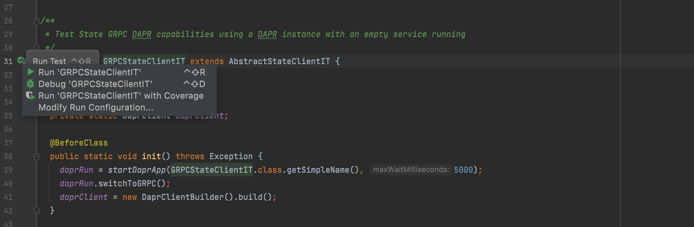

# Dapr SDK for Java

[](https://central.sonatype.com/artifact/io.dapr/dapr-sdk) [](https://github.com/dapr/java-sdk/actions/workflows/build.yml) [](https://codecov.io/gh/dapr/java-sdk) [](https://github.com/dapr/java-sdk/blob/master/LICENSE) [](https://app.fossa.com/projects/custom%2B162%2Fgithub.com%2Fdapr%2Fjava-sdk?ref=badge_shield) [](https://github.com/dapr/java-sdk/issues?q=is%3Aissue+is%3Aopen+label%3A%22good+first+issue%22) [](http://bit.ly/dapr-discord) [](https://youtube.com/@daprdev) [](https://twitter.com/daprdev)

This is the Dapr SDK for Java, including the following features:

* PubSub
* Service Invocation
* Binding
* State Store
* Actors

## Getting Started

### Pre-Requisites
* SDKMAN! installed (recommended):
    * [SDKMAN!](https://sdkman.io)
* Java IDE installed:
    * [IntelliJ](https://www.jetbrains.com/idea/download/)
    * [Eclipse](https://www.eclipse.org/downloads/)
    * [Apache NetBeans](https://netbeans.apache.org/download/index.html)
    * [Visual Studio Code](https://code.visualstudio.com/Download)
    * Any other IDE for Java that you prefer.
* Install one of the following build tools for Java:
    * [Maven 3.x](https://maven.apache.org/install.html)
    * [Gradle 6.x](https://gradle.org/install/)
* If needed, install the corresponding plugin for the build tool in your IDE, for example:
    * [Maven in IntelliJ](https://www.jetbrains.com/help/idea/maven.html)
    * [Gradle in IntelliJ](https://www.jetbrains.com/help/idea/gradle-settings.html)
    * [Maven in Eclipse with m2e](https://projects.eclipse.org/projects/technology.m2e)
    * [Gradle in Eclipse with Buildship](https://projects.eclipse.org/projects/tools.buildship)
* An existing Java Maven or Gradle project. You may also start a new project via one of the options below:
    * [New Maven project in IntelliJ](https://www.jetbrains.com/help/idea/maven-support.html#create_new_maven_project)
    * [Maven in 5 minutes](https://maven.apache.org/guides/getting-started/maven-in-five-minutes.html)
    * [Install toxiproxy-server binary](https://github.com/Shopify/toxiproxy/releases)

### Install JDK

If using [SDKMAN!](https://sdkman.io), execute `sdk env install` to install the required JDK.

### Importing Dapr's Java SDK
For a Maven project, add the following to your `pom.xml` file:
```xml
<project>
  ...
  <dependencies>
    ...
     <!-- Dapr's core SDK with all features, except Actors. -->
    <dependency>
      <groupId>io.dapr</groupId>
      <artifactId>dapr-sdk</artifactId>
      <version>1.12.1</version>
    </dependency>
    <!-- Dapr's SDK for Actors (optional). -->
    <dependency>
      <groupId>io.dapr</groupId>
      <artifactId>dapr-sdk-actors</artifactId>
      <version>1.12.1</version>
    </dependency>
    <!-- Dapr's SDK integration with SpringBoot (optional). -->
    <dependency>
      <groupId>io.dapr</groupId>
      <artifactId>dapr-sdk-springboot</artifactId>
      <version>1.12.1</version>
    </dependency>
    ...
  </dependencies>
  ...
</project>
```

For a Gradle project, add the following to your `build.gradle` file:

```
dependencies {
...
    // Dapr's core SDK with all features, except Actors.
    compile('io.dapr:dapr-sdk:1.12.1')
    // Dapr's SDK for Actors (optional).
    compile('io.dapr:dapr-sdk-actors:1.12.1')
    // Dapr's SDK integration with SpringBoot (optional).
    compile('io.dapr:dapr-sdk-springboot:1.12.1')
}
```

### Running the examples
Clone this repository including the submodules:

```sh
git clone https://github.com/dapr/java-sdk.git
```

Then head over to build the [Maven](https://maven.apache.org/install.html) (Apache Maven version 3.x) project:

```sh
# make sure you are in the `java-sdk` directory.
./mvnw clean install
```

Try the following examples to learn more about Dapr's Java SDK:
* [Invoking a Http service](./examples/src/main/java/io/dapr/examples/invoke/http)
* [Invoking a Grpc service](./examples/src/main/java/io/dapr/examples/invoke/grpc)
* [State management](./examples/src/main/java/io/dapr/examples/state)
* [PubSub with subscriber](./examples/src/main/java/io/dapr/examples/pubsub/)
* [Binding with input over Http](./examples/src/main/java/io/dapr/examples/bindings/http)
* [Actors](./examples/src/main/java/io/dapr/examples/actors/)
* [Secrets management](./examples/src/main/java/io/dapr/examples/secrets)
* [Configuration](./examples/src/main/java/io/dapr/examples/configuration)
* [Distributed tracing with OpenTelemetry SDK](./examples/src/main/java/io/dapr/examples/tracing)
* [Exception handling](./examples/src/main/java/io/dapr/examples/exception)
* [Unit testing](./examples/src/main/java/io/dapr/examples/unittesting)

### API Documentation

Please, refer to our [Javadoc](https://dapr.github.io/java-sdk/) website.

### Reactor API

The Java SDK for Dapr is built using [Project Reactor](https://projectreactor.io/). It provides an asynchronous API for Java. A result is consumed synchronously by using the `block()` method, as shown in the examples referenced above.

The code below does not make any API call, it simply returns the [Mono](https://projectreactor.io/docs/core/release/api/reactor/core/publisher/Mono.html) publisher object. Nothing happens until the application subscribes or blocks on the result:

```java
Mono<Void> result = daprClient.publishEvent("mytopic", "my message");
```

To start execution and receive the result object synchronously (`void` or `Void` becomes an empty result), use `block()`. The code below shows how to execute the call and consume an empty response:
```java
Mono<Void> result = daprClient.publishEvent("mytopic", "my message");
result.block();
```

### How to use a custom serializer

This SDK provides a basic serialization for request/response objects, and state objects. Applications should provide their own serialization for production scenarios.

1. Implement the [DaprObjectSerializer](https://dapr.github.io/java-sdk/io/dapr/serializer/DaprObjectSerializer.html) interface. See [this class](sdk-actors/src/test/java/io/dapr/actors/runtime/JavaSerializer.java) as an example.
2. Use your serializer class in the following scenarios:
    * When building a new instance of [DaprClient](https://dapr.github.io/java-sdk/io/dapr/client/DaprClient.html):
    ```java
    DaprClient client = (new DaprClientBuilder())
        .withObjectSerializer(new MyObjectSerializer()) // for request/response objects.
        .withStateSerializer(new MyStateSerializer()) // for state objects.
        .build();
    ```
    * When registering an Actor Type:
    ```java
    ActorRuntime.getInstance().registerActor(
      DemoActorImpl.class,
      new MyObjectSerializer(), // for request/response objects.
      new MyStateSerializer()); // for state objects.
    ```
    * When building a new instance of [ActorProxy](https://dapr.github.io/java-sdk/io/dapr/actors/client/ActorProxy.html) to invoke an Actor instance, use the same serializer as when registering the Actor Type:
    ```java
    try (ActorClient actorClient = new ActorClient()) {
      DemoActor actor = (new ActorProxyBuilder(DemoActor.class, actorClient))
          .withObjectSerializer(new MyObjectSerializer()) // for request/response objects.
          .build(new ActorId("100"));
    }
    ```


### Debug a Java application or Dapr's Java SDK

**In IntelliJ Community Edition, consider [debugging in IntelliJ](https://docs.dapr.io/developing-applications/local-development/ides/intellij/).**

**In Visual Studio Code, consider [debugging in Visual Studio Code](https://docs.dapr.io/developing-applications/local-development/ides/vscode/).**

If you need to debug your Application, run the Dapr sidecar separately, and then start the application from your IDE (IntelliJ or Eclipse, for example).
For Linux and MacOS:

```sh
dapr run --app-id testapp --app-port 3000 --dapr-http-port 3500 --dapr-grpc-port 5001
```

> Note: confirm the correct port that the app will listen to and that the Dapr ports above are free, changing the ports if necessary.

When running your Java application from your IDE, make sure the following environment variables are set, so the Java SDK knows how to connect to Dapr's sidecar:
```
DAPR_HTTP_PORT=3500
DAPR_GRPC_PORT=5001
```

Now you can go to your IDE and debug your Java application, using port `3500` to call Dapr while also listening to port `3000` to expose Dapr's callback endpoint.

### Exception handling

Most exceptions thrown from the SDK are instances of `DaprException`. `DaprException` extends from `RuntimeException`, making it compatible with Project Reactor. See the [exception example](./examples/src/main/java/io/dapr/examples/exception) for more details.

## Development

### Update URL to fetch proto files

Change the `dapr.proto.baseurl` property below in [pom.xml](./pom.xml) to point to the URL for the desired commit hash in Git if you need to target a proto file that is not been merged into master yet. 

Note: You may need to run `./mvnw clean` after changing this setting to remove any auto-generated files so that the new proto files get downloaded and compiled.

```xml
<project>
  ...
  <properties>
    ...
    <!-- change this .... -->
    <dapr.proto.baseurl>https://raw.githubusercontent.com/dapr/dapr/(current ref in pom.xml)/dapr/proto</dapr.proto.baseurl>
    <!-- to something like this: -->
    <dapr.proto.baseurl>https://raw.githubusercontent.com/dapr/dapr/1ac5d0e8590a7d6772c9957c236351ed992ccb19/dapr/proto</dapr.proto.baseurl>
    ...
  </properties>
  ...
</project>
```

### Running Integration Tests (ITs)

#### Pre-Requisites
* [Pre-Requisites for the SDK](#pre-requisites)
* Docker installed 
  * [Docker Compose](https://docs.docker.com/compose/install/) 
  * [Docker Desktop](https://www.docker.com/products/docker-desktop)
* Bash shell
  * In Windows use [WSL2](https://docs.microsoft.com/en-us/windows/wsl/install)
  * In Linux and Mac, default shells are enough

#### Code

The code for the tests are present inside the project [sdk-tests](./sdk-tests). This module alone can be imported as a separate project in IDEs. 
This project depends on the rest of the JARs built by the other modules in the repo like [sdk](./sdk), [sdk-springboot](./sdk-springboot) etc.

As a starting point for running the Integration Tests, first run `./mvnw clean install` from the root of the repo to build the JARs for the different modules, except the `sdk-tests` module.

#### Run all the dependent services spun up during build

During normal CI build, docker compose is used to bring up services like MongoDB, Hashicorp Vault, Apache Zookeeper, Kafka etc. 

Similarly, all of these need to be run for running the ITs either individually or as a whole.

Run the following commands from the root of the repo to start all the docker containers that the tests depend on.

```bash
docker compose -f ./sdk-tests/deploy/local-test.yml up -d
```

To stop the containers and services, run the following commands.

```bash
docker compose -f ./sdk-tests/deploy/local-test.yml down
```


#### Run all ITs from command line
From the `java-sdk` repo root, change to the `sdk-tests` directory and run the following command.

```bash
## with current directory as /java-sdk/sdk-tests/

../mvnw clean install
```

The above command runs all the integration tests present in the `sdk-tests` project. 

#### Run Individual tests from IntelliJ

In IntelliJ, go to `File > New > Project from Existing Sources...`. Import the `sdk-tests` project. 

Once the project has been imported, the individual tests can be run normally as any Unit Tests, from the IDE itself.

.

> Sometimes when the `sdk-tests` project does not build correctly, try `File > Invalidate Caches...`  and try restarting IntelliJ.

You should be able to set breakpoints and Debug the test directly from IntelliJ itself as seen from the above image. 
