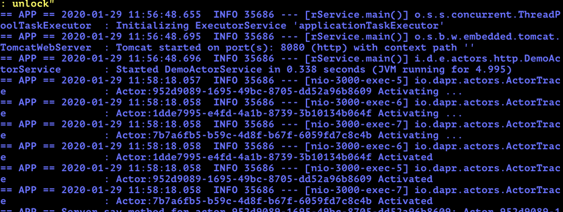
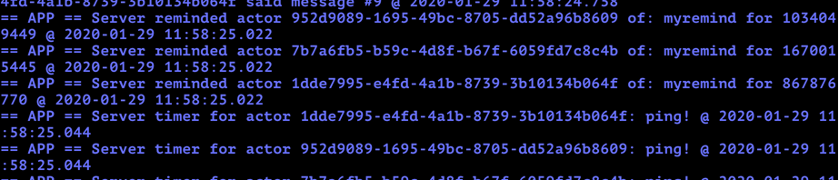
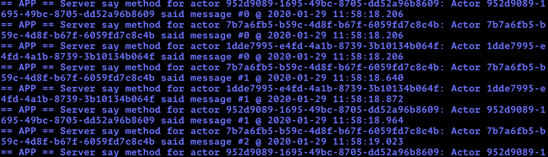
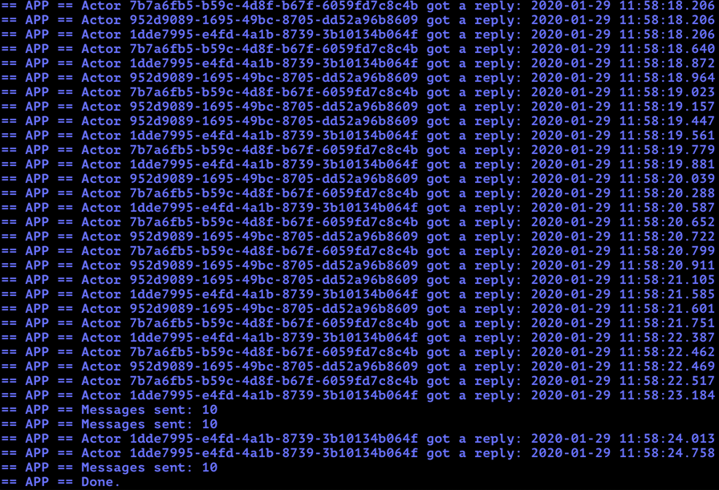

# Dapr Actors Sample

In this example, we'll use Dapr to test the actor pattern capabilities such as concurrency, state, life-cycle management for actor activation/deactivation and timers and reminders to wake-up actors.

Visit [this](https://github.com/dapr/docs/blob/master/concepts/actors/README.md) link for more information about the Actor pattern.

This example contains the follow classes:

* DemoActor: The interface for the actor. Exposes the different actor features.
* DemoActorImpl: The implementation for the DemoActor interface. Handles the logic behind the different actor features.
* DemoActorService: A Spring Boot application service that registers the actor into the Dapr actor runtime.
* DemoActorClient: This class will create and execute actors and its capabilities by using Dapr.
 
## Pre-requisites

* [Dapr and Dapr Cli](https://github.com/dapr/docs/blob/master/getting-started/environment-setup.md#environment-setup).
* Java JDK 11 (or greater): [Oracle JDK](https://www.oracle.com/technetwork/java/javase/downloads/index.html#JDK11) or [OpenJDK](https://jdk.java.net/13/).
* [Apache Maven](https://maven.apache.org/install.html) version 3.x.

### Checking out the code

Clone this repository:

```sh
git clone https://github.com/dapr/java-sdk.git
cd java-sdk
```

Then build the Maven project:

```sh
# make sure you are in the `java-sdk` directory.
mvn install
```

Get into the examples directory.
```sh
cd examples
```

### Running the Demo actor service

The first Java class is `DemoActorService`. Its job is to register an implementation of `DemoActor` in the Dapr's Actor runtime. In `DemoActorService.java` file, you will find the `DemoActorService` class and the `main` method. See the code snippet below:

```java
public class DemoActorService {

  public static void main(String[] args) throws Exception {
	///...
    // Register the Actor class.
    ActorRuntime.getInstance().registerActor(DemoActorImpl.class);

    // Start Dapr's callback endpoint.
    DaprApplication.start(port);
  }
}
```

This application uses `ActorRuntime.getInstance().registerActor()` in order to register `DemoActorImpl` as an actor in the Dapr Actor runtime. Internally, it is using `DefaultObjectSerializer` for two properties: `objectSerializer` is for Dapr's sent and received objects, and `stateSerializer` is for objects to be persisted.
 

`DaprApplication.start()` method will run the Spring Boot [DaprApplication](../../../springboot/DaprApplication.java), which registers the Dapr Spring Boot controller [DaprController](https://github.com/dapr/java-sdk/blob/master/sdk-springboot/src/main/java/io/dapr/springboot/DaprController.java). This controller contains all Actor methods implemented as endpoints. The Dapr's sidecar will call into the controller.

See [DemoActorImpl](DemoActorImpl.java) for details on the implementation of an actor:
```java
public class DemoActorImpl extends AbstractActor implements DemoActor, Remindable<Integer> {
  //...

  public DemoActorImpl(ActorRuntimeContext runtimeContext, ActorId id) {
    super(runtimeContext, id);
    //...
  }

  @Override
  public void registerReminder() {
    //...
  }

  @Override
  public String say(String something) {
    //...
  }

  @Override
  public Mono<Integer> incrementAndGet(int delta) {
    //...
  }

  @Override
  public void clock(String message) {
    //...
  }

  @Override
  public Class<Integer> getStateType() {
    return Integer.class;
  }

  @Override
  public Mono<Void> receiveReminder(String reminderName, Integer state, Duration dueTime, Duration period) {
    //...
  }
}
```
An actor inherits from `AbstractActor` and implements the constructor to pass through `ActorRuntimeContext` and `ActorId`. By default, the actor's name will be the same as the class' name. Optionally, it can be annotated with `ActorType` and override the actor's name. The actor's methods can be synchronously or use [Project Reactor's Mono](https://projectreactor.io/docs/core/release/api/reactor/core/publisher/Mono.html) return type. Finally, state management is done via methods in `super.getActorStateManager()`. The `DemoActor` interface is used by the Actor runtime and also client. See how `DemoActor` interface can be annotated as Dapr Actor.

```java
/**
 * Example of implementation of an Actor.
 */
@ActorType(name = "DemoActor")
public interface DemoActor {

  void registerReminder();

  String say(String something);

  void clock(String message);

  @ActorMethod(returns = Integer.class)
  Mono<Integer> incrementAndGet(int delta);
}

```

The `@ActorType` annotation indicates the Dapr Java SDK that this interface is an Actor Type, allowing a name for the type to be defined. Some methods can return a `Mono` object. In these cases, the `@ActorMethod` annotation is used to hint the Dapr Java SDK of the type encapsulated in the `Mono` object. You can read more about Java generic type erasure [here](https://docs.oracle.com/javase/tutorial/java/generics/erasure.html).  


Now, execute the following script in order to run DemoActorService:
```sh
dapr run --components-path ./components --app-id demoactorservice --app-port 3000 --port 3005 -- java -jar target/dapr-java-sdk-examples-exec.jar io.dapr.examples.actors.http.DemoActorService -p 3000
```

### Running the Actor client

The actor client is a simple java class with a main method that uses the Dapr Actor capabilities in order to create the actors and execute the different methods based on the Actor pattern.

The `DemoActorClient.java` file contains the `DemoActorClient` class. See the code snippet below:

```java
public class DemoActorClient {

  private static final int NUM_ACTORS = 3;

  public static void main(String[] args) throws InterruptedException {
    ActorProxyBuilder<DemoActor> builder = new ActorProxyBuilder(DemoActor.class);
    ///...
    for (int i = 0; i < NUM_ACTORS; i++) {
      DemoActor actor = builder.build(ActorId.createRandom());

      // Start a thread per actor.
      Thread thread = new Thread(() -> callActorForever(actorId.toString(), actor));
      thread.start();
      threads.add(thread);
    }
    ///...
  }

  private static final void callActorForever(String actorId, DemoActor actor) {
    // First, register reminder.
    actor.registerReminder();
 
    // Now, we run until thread is interrupted.
    while (!Thread.currentThread().isInterrupted()) {
      // Invoke actor method to increment counter by 1, then build message.
      int messageNumber = actor.incrementAndGet(1).block();
      String message = String.format("Actor %s said message #%d", actorId, messageNumber);
   
      // Invoke the 'say' method in actor.
      String result = actor.say(message);
      System.out.println(String.format("Actor %s got a reply: %s", actorId, result));
    
      try {
        // Waits for up to 1 second.
        Thread.sleep((long) (1000 * Math.random()));
      } catch (InterruptedException e) {
        // We have been interrupted, so we set the interrupted flag to exit gracefully.
        Thread.currentThread().interrupt();
      }
    }
  }
}
```

First, the client defines how many actors it is going to create. Then the main method declares a `ActorProxyBuilder` to create instances of the `DemoActor` interface, which are implemented automatically by the SDK and make remote calls to the equivalent methods in Actor runtime. The code executes the `callActorForever` private method once per actor. Initially, it will invoke `registerReminder()`, which sets the due time and period for the reminder. Then, `incrementAndGet()` increments a counter, persists it and sends it back as response. Finally `say` method which will print a message containing the received string along with the formatted server time. 

Use the follow command to execute the DemoActorClient:

```sh
dapr run --components-path ./components --app-id demoactorclient --port 3006 -- java -jar target/dapr-java-sdk-examples-exec.jar io.dapr.examples.actors.http.DemoActorClient
```

Once running, the `DemoActorClient` logs will start displaying the different steps: 
First, we can see actors being activated:


Then we can see the `registerReminder` in action. `DemoActorClient` console displays the actors handling reminders:


After invoking `incrementAndGet`, the code invokes `say` method (you'll see these messages 10 times per each of the 3 actors):


On the other hand, the console for `DemoActorService` is also responding to the remote invocations:


For more details on Dapr SpringBoot integration, please refer to [Dapr Spring Boot](../../../springboot/DaprApplication.java) Application implementation.

### Limitations

Currently, these are the limitations in the Java SDK for Dapr:
* Actor interface cannot have overloaded methods (methods with same name but different signature).
* Actor methods can only have zero or one parameter.
