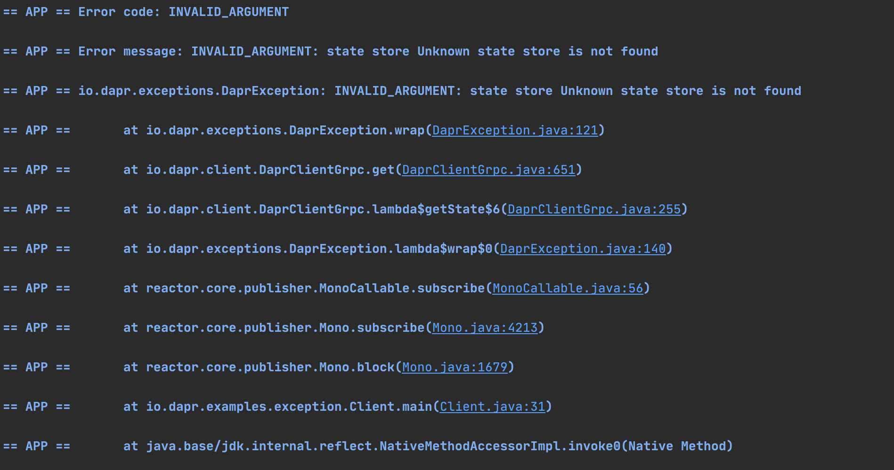

## Exception handling sample

This sample illustrates how to handle exceptions in Dapr.

## Pre-requisites

* [Dapr and Dapr Cli](https://docs.dapr.io/getting-started/install-dapr/).
* Java JDK 11 (or greater): [Oracle JDK](https://www.oracle.com/technetwork/java/javase/downloads/index.html#JDK11) or [OpenJDK](https://jdk.java.net/13/).
* [Apache Maven](https://maven.apache.org/install.html) version 3.x.

### Checking out the code

Clone this repository:

```sh
git clone https://github.com/dapr/java-sdk.git
cd java-sdk
```

Then build the Maven project:

```sh
# make sure you are in the `java-sdk` directory.
mvn install
```

Then get into the examples directory:
```sh
cd examples
```

### Running the StateClient
This example uses the Java SDK Dapr client in order perform an invalid operartion, causing Dapr runtime to return an error. See the code snippet bellow: 

```java
public class Client {

  public static void main(String[] args) throws Exception {
    try (DaprClient client = new DaprClientBuilder().build()) {

      try {
        client.getState("Unknown state store", "myKey", String.class).block();
      } catch (DaprException exception) {
        System.out.println("Error code: " + exception.getErrorCode());
        System.out.println("Error message: " + exception.getMessage());

        exception.printStackTrace();
      }

      System.out.println("Done");
    }
  }

}
```
The code uses the `DaprClient` created by the `DaprClientBuilder`. It tries to get a state from state store but provides an unknown state store. It causes Dapr sidecar to return error, which is converted to a `DaprException` to the application. To be compatible with Project Reactor, `DaprException` extends from `RuntimeException` - making it an unchecked exception. Applications might also get `IllegalArgumentException` when invoking methods with invalid input parameters that are validated at the client side.

The Dapr client is also within a try-with-resource block to properly close the client at the end.

### Running the example

Run this example with the following command:

<!-- STEP
name: Run exception example 
expected_stdout_lines:
  - '== APP == Error code: INVALID_ARGUMENT'
  - '== APP == Error message: INVALID_ARGUMENT: state store Unknown state store is not found'
background: true
sleep: 5
-->

```bash
dapr run --app-id exception_example -- java -jar target/dapr-java-sdk-examples-exec.jar io.dapr.examples.exception.Client
```

<!-- END_STEP -->

Once running, the OutputBindingExample should print the output as follows:



### Cleanup

To stop the app run (or press `CTRL+C`):

<!-- STEP
name: Cleanup
-->

```bash
dapr stop --app-id exception_example
```

<!-- END_STEP -->