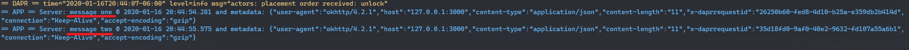

# Method invocation Sample

In this sample, we'll create two java applications: a service application which exposes a method and a client application which will invoke the method from the service using Dapr.
This sample includes:

* DemoService (Exposes the method to be remotely accessed)
* InvokeClient (Invokes the exposed method from DemoService)

Visit [this](https://github.com/dapr/docs/blob/master/concepts/service-invocation/service-invocation.md) link for more information about Dapr and service invocation.
 
## Remote invocation using the Java-SDK

This sample uses the Client provided in Dapr Java SDK invoking a remote method. 

## Pre-requisites

* [Dapr and Dapr CLI](https://github.com/dapr/docs/blob/master/getting-started/environment-setup.md#environment-setup).
* Java JDK 11 (or greater): [Oracle JDK](https://www.oracle.com/technetwork/java/javase/downloads/index.html#JDK11) or [OpenJDK](https://jdk.java.net/13/).
* [Apache Maven](https://maven.apache.org/install.html) version 3.x.

### Checking out the code

Clone this repository:

```sh
git clone https://github.com/dapr/java-sdk.git
cd java-sdk
```

Then build the Maven project:

```sh
# make sure you are in the `java-sdk` directory.
mvn install
```

### Running the Demo service sample

The Demo service application is meant to expose a method that can be remotely invoked. In this example, the service code has two parts:

In the `DemoService.java` file, you will find the `DemoService` class, containing the main method. The main method uses the Spring Boot´s DaprApplication class for initializing the `ExposerServiceController`. See the code snippet below:

```java
public class DemoService {
  ///...
  public static void main(String[] args) throws Exception {
    ///...
    // If port string is not valid, it will throw an exception.
    int port = Integer.parseInt(cmd.getOptionValue("port"));

    DaprApplication.start(port);
  }
}
```

`DaprApplication.start()` Method will run an Spring Boot application that registers the `DemoServiceController`, which exposes the invoking action as a POST request. The Dapr's sidecar is the one that performs the actual call to the controller, triggered by client invocations or [bindings](https://github.com/dapr/docs/blob/master/concepts/bindings/README.md).

This Spring Controller exposes the `say` method. The method retrieves metadata from the headers and prints them along with the current date in console. The actual response from method is the formatted current date. See the code snippet below:

```java
@RestController
public class DemoServiceController {
  ///...
  @PostMapping(path = "/say")
  public Mono<String> handleMethod(@RequestBody(required = false) byte[] body,
                                   @RequestHeader Map<String, String> headers) {
    return Mono.fromSupplier(() -> {
      try {
        String message = body == null ? "" : new String(body, StandardCharsets.UTF_8);

        Calendar utcNow = Calendar.getInstance(TimeZone.getTimeZone("GMT"));
        String utcNowAsString = DATE_FORMAT.format(utcNow.getTime());

        String metadataString = headers == null ? "" : OBJECT_MAPPER.writeValueAsString(headers);

        // Handles the request by printing message.
        System.out.println(
          "Server: " + message + " @ " + utcNowAsString + " and metadata: " + metadataString);

        return utcNowAsString;
      } catch (Exception e) {
        throw new RuntimeException(e);
      }
    });
  }
}
```

Use the follow command to execute the demo service example:

```sh
dapr run --app-id invokedemo --app-port 3000 --port 3005 -- java -jar examples/target/dapr-java-sdk-examples-exec.jar io.dapr.examples.invoke.http.DemoService -p 3000
```

Once running, the ExposerService is now ready to be invoked by Dapr.


### Running the InvokeClient sample

The Invoke client sample uses the Dapr SDK for invoking the remote method. The main method declares a Dapr Client using the `DaprClientBuilder` class. Notice that [DaprClientBuilder](https://github.com/dapr/java-sdk/blob/master/sdk/src/main/java/io/dapr/client/DaprClientBuilder.java) can receive two optional serializers: `withObjectSerializer()` is for Dapr's sent and received objects, and `withStateSerializer()` is for objects to be persisted. It needs to know the method name to invoke as well as the application id for the remote application. This example, we stick to the [default serializer](https://github.com/dapr/java-sdk/blob/master/sdk/src/main/java/io/dapr/serializer/DefaultObjectSerializer.java). In `InvokeClient.java` file, you will find the `InvokeClient` class and the `main` method. See the code snippet below:

```java
public class InvokeClient {

private static final String SERVICE_APP_ID = "invokedemo";
///...
  public static void main(String[] args) {
    DaprClient client = (new DaprClientBuilder()).build();
    for (String message : args) {
      byte[] response = client.invokeService(
          Verb.POST, SERVICE_APP_ID, "say", message, null, byte[].class).block();
      System.out.println(new String(response));
    }
  }
///...
}
```

The class knows the app id for the remote application. It uses the the static `Dapr.getInstance().invokeService` method to invoke the remote method defining the parameters: The verb, application id, method name, and proper data and metadata, as well as the type of the expected return type. The returned payload for this method invocation is plain text and not a [JSON String](https://www.w3schools.com/js/js_json_datatypes.asp), so we expect `byte[]` to get the raw response and not try to deserialize it.
 
 Execute the follow script in order to run the InvokeClient example, passing two messages for the remote method:
```sh
dapr run --port 3006 -- java -jar examples/target/dapr-java-sdk-examples-exec.jar io.dapr.examples.invoke.http.InvokeClient 'message one' 'message two'
```
Once running, the output should display the messages sent from invoker in the demo service output as follows:



Method have been remotely invoked and displaying the remote messages.

For more details on Dapr Spring Boot integration, please refer to [Dapr Spring Boot](../../../springboot/DaprApplication.java) Application implementation.
