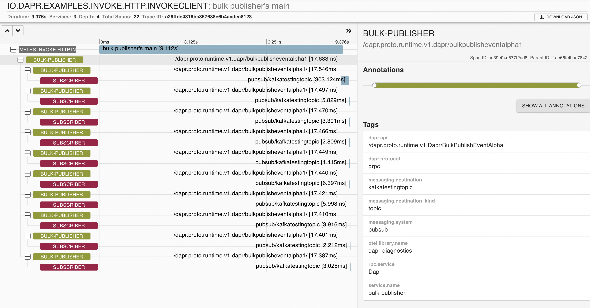

# Dapr Bulk Publish Normal Subscribe Example

In this sample, we'll create a publisher and a subscriber java applications using Dapr, based on the publish-subcribe pattern. The publisher will generate messages of a specific topic, while subscriber will listen for messages of specific topic. See [Why Pub-Sub](#why-pub-sub) to understand when this pattern might be a good choice for your software architecture.

Visit [this](https://docs.dapr.io/developing-applications/building-blocks/pubsub/pubsub-overview/) link for more information about Dapr and Pub-Sub.

## BulkPublish individual Subscribe Sample using the Java-SDK

This sample uses the HTTP Springboot integration provided in Dapr Java SDK for subscribing, and GRPC Dapr client for bulk publishing multiple messages. 
This example uses Kafka as publish subscribe broker.

## Pre-requisites

* [Dapr and Dapr Cli](https://docs.dapr.io/getting-started/install-dapr/).
* Java JDK 11 (or greater):
    * [Microsoft JDK 11](https://docs.microsoft.com/en-us/java/openjdk/download#openjdk-11)
    * [Oracle JDK 11](https://www.oracle.com/technetwork/java/javase/downloads/index.html#JDK11)
    * [OpenJDK 11](https://jdk.java.net/11/)
* [Apache Maven](https://maven.apache.org/install.html) version 3.x.

### Checking out the code

Clone this repository:

```sh
git clone https://github.com/dapr/java-sdk.git
cd java-sdk
```

Then build the Maven project:

```sh
# make sure you are in the `java-sdk` directory.
mvn install
```

Then get into the `examples` directory:

```sh
cd examples
```

### Running the subscriber

The first is the subscriber. It will subscribe to the topic to be used by the publisher and read the messages published. The `KafkaSubscriber` uses the Spring Boot´s DaprApplication class for initializing the `KafkaController`. In `KafkaSubscriber.java` file, you will find the `KafkaSubscriber` class and the `main` method. See the code snippet below:

```java
public class KafkaSubscriber {

  public static void main(String[] args) throws Exception {
    ///...
    // Start Dapr's callback endpoint.
    DaprApplication.start(port);
  }
}
```
`DaprApplication.start()` Method will run a Spring Boot application that registers the `KafkaController`, which exposes the message retrieval as a POST API. The Dapr's sidecar is the one that performs the actual call to the controller, based on pubsub features.

This Spring Controller handles the message endpoint, printing the message which is received as the POST body.

The subscription's topic in Dapr is handled automatically via the `@Topic` annotation - which also supports the same expressions as in
[Spring's @Value annotations](https://docs.spring.io/spring-framework/docs/current/reference/html/core.html#beans-value-annotations).

The code snippet below shows how to create a subscription using the `@Topic` annotation showcasing expression support. In this case, `myAppProperty` is a Java property that does not exist, so the expression resolves to the default value (`kafka-pubsub`).

```java
@RestController
public class KafkaController {
  ///...
  @Topic(name = "kafkatestingtopic", pubsubName = "${myAppProperty:kafka-pubsub}")
  @PostMapping(path = "/kafkatestingtopic")
  public Mono<Void> handleMessage(@RequestBody(required = false) byte[] body,
                                   @RequestHeader Map<String, String> headers) {
    return Mono.fromRunnable(() -> {
      try {
        // Dapr's event is compliant to CloudEvent.
        CloudEventEnvelope envelope = SERIALIZER.deserialize(body, CloudEventEnvelope.class);

        String message = envelope.getData() == null ? "" : envelope.getData();
        System.out.println("Subscriber got message: " + message);
      } catch (Exception e) {
        throw new RuntimeException(e);
      }
    });
  }
}
```
Execute the follow script in order to run the Subscriber example:

<!-- STEP
name: Run Subscriber
expected_stdout_lines:
  - '== APP == Subscriber got: This is message #1'
  - '== APP == Subscriber got: This is message #2'
background: true
sleep: 5
-->

```bash
dapr run --components-path ./components/pubsub --app-id subscriber --app-port 3000 -- java -jar target/dapr-java-sdk-examples-exec.jar io.dapr.examples.pubsub.bulk.KafkaSubscriber -p 3000
```

<!-- END_STEP -->

### Running the publisher

The other component is the bulk publisher. It is a simple java application with a main method that uses the Dapr GRPC Preview Client to publish 10 messages to a specific topic in a single call.

In the `BulkPublisher.java` file, you will find the `BulkPublisher` class, containing the main method. The main method declares a Dapr Preview Client using the `DaprClientBuilder` class. Notice that this builder gets two serializer implementations in the constructor: One is for Dapr's sent and recieved objects, and second is for objects to be persisted. 
The client publishes messages using `publishEvents` method. The Dapr client is also within a try-with-resource block to properly close the client at the end. See the code snippet below:
Dapr sidecar will automatically wrap the payload received into a CloudEvent object, which will later on be parsed by the subscriber.
```java
public class BulkPublisher {
  private static final int NUM_MESSAGES = 10;
  private static final String TOPIC_NAME = "kafkatestingtopic";
  private static final String PUBSUB_NAME = "kafka-pubsub";

  ///...
  public static void main(String[] args) throws Exception {
    OpenTelemetry openTelemetry = OpenTelemetryConfig.createOpenTelemetry();
    Tracer tracer = openTelemetry.getTracer(BulkPublisher.class.getCanonicalName());
    Span span = tracer.spanBuilder("Bulk Publisher's Main").setSpanKind(Span.Kind.CLIENT).startSpan();
    try (DaprPreviewClient client = (new DaprClientBuilder()).buildPreviewClient()) {
      DaprClient c = (DaprClient)client;
      c.waitForSidecar(10000);
      try (Scope scope = span.makeCurrent()) {
        System.out.println("Using preview client...");
        List<String> messages = new ArrayList<>();
        System.out.println("Constructing the list of messages to publish");
        for (int i = 0; i < NUM_MESSAGES; i++) {
          String message = String.format("This is message #%d", i);
          messages.add(message);
          System.out.println("Going to publish message : " + message);
        }
        BulkPublishResponse res = client.publishEvents(PUBSUB_NAME, TOPIC_NAME, messages, "text/plain")
                .subscriberContext(getReactorContext()).block();
        System.out.println("Published the set of messages in a single call to Dapr");
        if (res != null) {
          System.out.println("Response for each individual message based on EntryID "
                  + "(in this index of message in list above)");
          for (BulkPublishResponseEntry entry : res.getStatuses()) {
            System.out.println("EntryID : " + entry.getEntryID() + " Status : " + entry.getStatus());
          }
        } else {
          throw new Exception("null response from dapr");
        }
      }
      // Close the span.

      span.end();
      // Allow plenty of time for Dapr to export all relevant spans to the tracing infra.
      Thread.sleep(10000);
      // Shutdown the OpenTelemetry tracer.
      OpenTelemetrySdk.getGlobalTracerManagement().shutdown();
  }
}
```
The code uses the `DaprPreviewClient` created by the `DaprClientBuilder` is used for the `publishEvents` (BulkPublish) preview API.

In this case, when `publishEvents` call is made, one of the argument to the method is the content type of data, this being `text/plain` in the example.
In this case, when parsing and printing the response, there is a concept of EntryID, which is automatically generated or can be set manually when using the `BulkPublishRequest` object.
The EntryID is a request scoped ID, in this case automatically generated as the index of the message in the list of messages in the `publishEvents` call.

The response, will be a response which contains the details of Publish status of each message in the bulk publish request. There can be scenarios where there are partial failures also. 
This is to some extent component dependent as in if component returns partial failures or not.

The code also shows the scenario where it is possible to start tracing in code and pass on that tracing context to Dapr. 

The `CloudEventBulkPublisher.java` file shows how the same can be accomplished if the application must send a CloudEvent object instead of relying on Dapr's automatic CloudEvent "wrapping".
In this case, the app MUST override the content-type parameter via `withContentType()`, so Dapr sidecar knows that the payload is already a CloudEvent object.

```java
public class CloudEventBulkPublisher {
  ///...
  public static void main(String[] args) throws Exception {
    try (DaprPreviewClient client = (new DaprClientBuilder()).buildPreviewClient()) {
      // Construct request
      BulkPublishRequest<CloudEvent<Map<String, String>>> request = new BulkPublishRequest<>(PUBSUB_NAME, TOPIC_NAME);
      List<BulkPublishRequestEntry<CloudEvent<Map<String, String>>>> entries = new ArrayList<>();
      for (int i = 0; i < NUM_MESSAGES; i++) {
        CloudEvent<Map<String, String>> cloudEvent = new CloudEvent<>();
        cloudEvent.setId(UUID.randomUUID().toString());
        cloudEvent.setType("example");
        cloudEvent.setSpecversion("1");
        cloudEvent.setDatacontenttype("application/json");
        String val = String.format("This is message #%d", i);
        cloudEvent.setData(new HashMap<>() {
          {
            put("dataKey", val);
          }
        });
        BulkPublishRequestEntry<CloudEvent<Map<String, String>>> entry = new BulkPublishRequestEntry<>();
        entry.setEntryID("" + (i + 1))
                .setEvent(cloudEvent)
                .setContentType(CloudEvent.CONTENT_TYPE);
        entries.add(entry);
      }
      request.setEntries(entries);

      // Publish events
      BulkPublishResponse res = client.publishEvents(request).block();
      if (res != null) {
        for (BulkPublishResponseEntry entry : res.getStatuses()) {
          System.out.println("EntryID : " + entry.getEntryID() + " Status : " + entry.getStatus());
        }
      } else {
        throw new Exception("null response");
      }
      System.out.println("Done");
    }
  }
}
```

In the above code, there is a concept of EntryID, which is a request scoped ID field that needs to be unique within that request. In this case it is just the index. 

Use the follow command to execute the BulkPublisher example:

<!-- STEP
name: Run Publisher
expected_stdout_lines:
  - '== APP == EntryID : 1 Status : SUCCESS'
  - '== APP == EntryID : 2 Status : SUCCESS'
  - '== APP == EntryID : 3 Status : SUCCESS'
background: true
sleep: 15
-->

```bash
dapr run --components-path ./components/pubsub --app-id bulk-publisher -- java -jar target/dapr-java-sdk-examples-exec.jar io.dapr.examples.pubsub.bulk.BulkPublisher
```

<!-- END_STEP -->

Once running, the Publisher should print the output as follows:

```txt
✅  You're up and running! Both Dapr and your app logs will appear here.

== APP == Using preview client...
== APP == Constructing the list of messages to publish
== APP == Going to publish message : This is message #0
== APP == Going to publish message : This is message #1
== APP == Going to publish message : This is message #2
== APP == Going to publish message : This is message #3
== APP == Going to publish message : This is message #4
== APP == Going to publish message : This is message #5
== APP == Going to publish message : This is message #6
== APP == Going to publish message : This is message #7
== APP == Going to publish message : This is message #8
== APP == Going to publish message : This is message #9
== APP == Published the set of messages in a single call to Dapr
== APP == Response for each individual message based on EntryID (in this index of message in list above)
== APP == EntryID : 1 Status : SUCCESS
== APP == EntryID : 2 Status : SUCCESS
== APP == EntryID : 3 Status : SUCCESS
== APP == EntryID : 4 Status : SUCCESS
== APP == EntryID : 5 Status : SUCCESS
== APP == EntryID : 6 Status : SUCCESS
== APP == EntryID : 7 Status : SUCCESS
== APP == EntryID : 8 Status : SUCCESS
== APP == EntryID : 9 Status : SUCCESS
== APP == EntryID : 10 Status : SUCCESS
== APP == Done

```

Messages have been published in the topic.

Once running, the Subscriber should print the output as follows:

```txt
== APP == Subscriber got: This is message #0
== APP == Subscriber got: {"id":"bb2f4833-0473-446b-a6cc-04a36de5ac0a","source":"bulk-publisher","type":"com.dapr.event.sent","specversion":"1.0","datacontenttype":"text/plain","data":"This is message #0","data_base64":null}
== APP == Subscriber got: This is message #1
== APP == Subscriber got: {"id":"323935ed-d8db-4ea2-ba28-52352b1d1b34","source":"bulk-publisher","type":"com.dapr.event.sent","specversion":"1.0","datacontenttype":"text/plain","data":"This is message #1","data_base64":null}
== APP == Subscriber got: This is message #2
== APP == Subscriber got: {"id":"2976f254-7859-449e-b66c-57fab4a72aef","source":"bulk-publisher","type":"com.dapr.event.sent","specversion":"1.0","datacontenttype":"text/plain","data":"This is message #2","data_base64":null}
== APP == Subscriber got: This is message #3
== APP == Subscriber got: {"id":"f21ff2b5-4842-481d-9a96-e4c299d1c463","source":"bulk-publisher","type":"com.dapr.event.sent","specversion":"1.0","datacontenttype":"text/plain","data":"This is message #3","data_base64":null}
== APP == Subscriber got: This is message #4
== APP == Subscriber got: {"id":"4bf50438-e576-4f5f-bb40-bd31c716ad02","source":"bulk-publisher","type":"com.dapr.event.sent","specversion":"1.0","datacontenttype":"text/plain","data":"This is message #4","data_base64":null}
== APP == Subscriber got: This is message #5
== APP == Subscriber got: {"id":"07bad175-4be4-4beb-a983-4def2eba5768","source":"bulk-publisher","type":"com.dapr.event.sent","specversion":"1.0","datacontenttype":"text/plain","data":"This is message #5","data_base64":null}
== APP == Subscriber got: This is message #6
== APP == Subscriber got: {"id":"b99fba4d-732a-4d18-bf10-b37916dedfb1","source":"bulk-publisher","type":"com.dapr.event.sent","specversion":"1.0","datacontenttype":"text/plain","data":"This is message #6","data_base64":null}
== APP == Subscriber got: This is message #7
== APP == Subscriber got: {"id":"f0c8b53b-7935-478e-856b-164d329d25ab","source":"bulk-publisher","type":"com.dapr.event.sent","specversion":"1.0","datacontenttype":"text/plain","data":"This is message #7","data_base64":null}
== APP == Subscriber got: This is message #8
== APP == Subscriber got: {"id":"df20d841-296e-4c6b-9dcb-dd17920538e7","source":"bulk-publisher","type":"com.dapr.event.sent","specversion":"1.0","datacontenttype":"text/plain","data":"This is message #8","data_base64":null}
== APP == Subscriber got: This is message #9
== APP == Subscriber got: {"id":"b280569f-cc29-471f-9cb7-682d8d6bd553","source":"bulk-publisher","type":"com.dapr.event.sent","specversion":"1.0","datacontenttype":"text/plain","data":"This is message #9","data_base64":null}
```

Messages have been retrieved from the topic.

### Tracing

Dapr handles tracing in Bulk Publish and individual message subscribe automatically. Open Zipkin on [http://localhost:9411/zipkin](http://localhost:9411/zipkin). You should see a screen like the one below:


Once you click on the tracing event, you will see the details of the call stack starting in the client and then showing the service API calls right below.




### Cleanup

<!-- STEP
name: Cleanup
-->

```bash
dapr stop --app-id bulk-publisher
dapr stop --app-id subscriber
```

<!-- END_STEP -->
