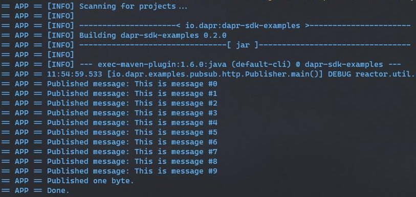
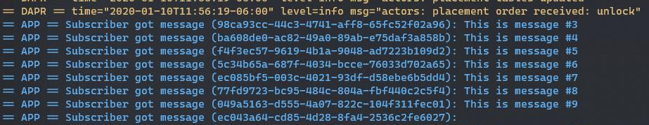

# Dapr Pub-Sub Sample

In this sample, we'll create a publisher and a subscriber java applications using Dapr, based on the publish-subcribe pattern. The publisher will generate messages of a specific topic, while subscriber will listen for messages of specific topic. See [Why Pub-Sub](#why-pub-sub) to understand when this pattern might be a good choice for your software architecture.

Visit [this](https://github.com/dapr/docs/tree/master/concepts/publish-subscribe-messaging) link for more information about Dapr and Pub-Sub.
 
## Pub-Sub Sample using the Java-SDK

This sample uses the HTTP Client provided in Dapr Java SDK for subscribing, and Dapr Spring Boot integration for publishing. This example uses Redis Streams (enabled in Redis versions => 5).
## Pre-requisites

* [Dapr and Dapr Cli](https://github.com/dapr/docs/blob/master/getting-started/environment-setup.md#environment-setup).
* Java JDK 11 (or greater): [Oracle JDK](https://www.oracle.com/technetwork/java/javase/downloads/index.html#JDK11) or [OpenJDK](https://jdk.java.net/13/).
* [Apache Maven](https://maven.apache.org/install.html) version 3.x.

### Checking out the code

Clone this repository:

```sh
git clone https://github.com/dapr/java-sdk.git
cd java-sdk
```

Then build the Maven project:

```sh
# make sure you are in the `java-sdk` directory.
mvn install
```

Then get into the examples directory:

```sh
cd examples
```

### Running the subscriber

The first is the subscriber. It will subscribe to the topic to be used by the publisher and read the messages published. The Subscriber uses the Spring Boot´s DaprApplication class for initializing the `SubscriberController`. In `Subscriber.java` file, you will find the `Subscriber` class and the `main` method. See the code snippet below:

```java
public class Subscriber {

  public static void main(String[] args) throws Exception {
    ///...
    // Start Dapr's callback endpoint.
    DaprApplication.start(port);
  }
}
```
`DaprApplication.start()` Method will run an Spring Boot application that registers the `SubscriberController`, which exposes the message retrieval as a POST request. The Dapr's sidecar is the one that performs the actual call to the controller, based on the pubsub features.

This Spring Controller handles the message endpoint, Printing the message which is received as the POST body. The topic subscription in Dapr is handled automatically via the `@Topic` annotation. See the code snippet below:

```java
@RestController
public class SubscriberController {
  ///...
  @Topic(name = "testingtopic", pubsubName = "messagebus")
  @PostMapping(path = "/testingtopic")
  public Mono<Void> handleMessage(@RequestBody(required = false) byte[] body,
                                   @RequestHeader Map<String, String> headers) {
    return Mono.fromRunnable(() -> {
      try {
        // Dapr's event is compliant to CloudEvent.
        CloudEventEnvelope envelope = SERIALIZER.deserialize(body, CloudEventEnvelope.class);

        String message = envelope.getData() == null ? "" : envelope.getData();
        System.out.println("Subscriber got message: " + message);
      } catch (Exception e) {
        throw new RuntimeException(e);
      }
    });
  }
}
```
Execute the follow script in order to run the Subscriber example:
```sh
dapr run --components-path ./components --app-id subscriber --app-port 3000 --dapr-http-port 3005 -- java -jar target/dapr-java-sdk-examples-exec.jar io.dapr.examples.pubsub.http.Subscriber -p 3000
```

### Running the publisher

The other component is the publisher. It is a simple java application with a main method that uses the Dapr HTTP Client to publish 10 messages to an specific topic.

In the `Publisher.java` file, you will find the `Publisher` class, containing the main method. The main method declares a Dapr Client using the `DaprClientBuilder` class. Notice that this builder gets two serializer implementations in the constructor: One is for Dapr's sent and recieved objects, and second is for objects to be persisted. The client publishes messages using `publishEvent` method. The Dapr client is also within a try-with-resource block to properly close the client at the end. See the code snippet below:  
```java
public class Publisher {
    private static final int NUM_MESSAGES = 10;
    private static final String TOPIC_NAME = "testingtopic";
    private static final String PUBSUB_NAME = "messagebus";

///...
  public static void main(String[] args) throws Exception {
      //Creating the DaprClient: Using the default builder client produces an HTTP Dapr Client
      try (DaprClient client = new DaprClientBuilder().build()) {
        for (int i = 0; i < NUM_MESSAGES; i++) {
          String message = String.format("This is message #%d", i);
          //Publishing messages
          client.publishEvent(PUBSUB_NAME, TOPIC_NAME, message).block();
          System.out.println("Published message: " + message);
          //...
        }
      }
  }
///...
}
```

This example also pushes a non-string content event, the follow code in same `Publisher` main method publishes a bite:

```java
public class Publisher {
///...
    public static void main(String[] args) throws Exception {
///...
    //Publishing a single bite: Example of non-string based content published
    client.publishEvent(
        TOPIC_NAME,
        new byte[] { 1 },
        Collections.singletonMap("content-type", "application/octet-stream")).block();
    System.out.println("Published one byte.");
    System.out.println("Done.");
  }
///...
}
```

Use the follow command to execute the Publisher example:

```sh
dapr run --components-path ./components --app-id publisher --dapr-http-port 3006 -- java -jar target/dapr-java-sdk-examples-exec.jar io.dapr.examples.pubsub.http.Publisher
```

Once running, the Publisher should print the output as follows:



Messages have been published in the topic.

Once running, the Subscriber should print the output as follows:



Messages have been retrieved from the topic.

For more details on Dapr Spring Boot integration, please refer to [Dapr Spring Boot](../../../springboot/DaprApplication.java) Application implementation.
