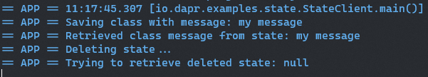

## State management sample

This sample illustrates the capabilities provided by Dapr Java SDK for state management. For further information about state management please refer to [this link](https://github.com/dapr/docs/blob/master/concepts/state-management/state-management.md)

## Pre-requisites

* [Dapr and Dapr Cli](https://github.com/dapr/docs/blob/master/getting-started/environment-setup.md#environment-setup).
* Java JDK 11 (or greater): [Oracle JDK](https://www.oracle.com/technetwork/java/javase/downloads/index.html#JDK11) or [OpenJDK](https://jdk.java.net/13/).
* [Apache Maven](https://maven.apache.org/install.html) version 3.x.

### Checking out the code

Clone this repository:

```sh
git clone https://github.com/dapr/java-sdk.git
cd java-sdk
```

Then build the Maven project:

```sh
# make sure you are in the `java-sdk` directory.
mvn install
```

### Running the StateClient
This example uses the Java SDK Dapr client in order to save, retrieve and delete a state, in this case, an instance of a class. Multiple state stores are supported since Dapr 0.4. See the code snippet bellow: 

```
public class StateClient {
  ///...
  private static final String STATE_STORE_NAME = "statestore";

  private static final String KEY_NAME = "mykey";
  ///...
  public static void main(String[] args) {
    DaprClient client = new DaprClientBuilder().build();
    String message = args.length == 0 ? " " : args[0];

    MyClass myClass = new MyClass();
    myClass.message = message;

    client.saveState(KEY_NAME, myClass).block();
    System.out.println("Saving class with message: " + message);

    Mono<State<MyClass>> retrievedMessageMono = client.getState(STATE_STORE_NAME, KEY_NAME, MyClass.class);
    System.out.println("Retrieved class message from state: " + (retrievedMessageMono.block().getValue()).message);

    System.out.println("Deleting state...");
    Mono<Void> mono = client.deleteState(STATE_STORE_NAME, KEY_NAME);
    mono.block();

    Mono<State<MyClass>> retrievedDeletedMessageMono = client.getState(STATE_STORE_NAME, KEY_NAME, MyClass.class);
    System.out.println("Trying to retrieve deleted state: " + retrievedDeletedMessageMono.block().getValue());
  }
}
```
The code uses the `DaprClient` created by the `DaprClientBuilder`. Notice that this builder uses default settings. Internally, it is using `DefaultObjectSerializer` for two properties: `objectSerializer` is for Dapr's sent and recieved objects, and `stateSerializer` is for objects to be persisted. This client performs three operations: `client.saveState(...)` for persisting an instance of `MyClass`, then uses the `client.getState(...)` operation in order to retrieve back the persisted state using the same key. `client.deleteState(...)` operation is used to remove the persisted state. Finally, the code tries to retrieve the deleted state, which should not be found.

### Running the example

Run this example with the following command:
```sh
dapr run --components-path ./components --port 3006 -- java -jar examples/target/dapr-java-sdk-examples-exec.jar io.dapr.examples.state.StateClient 'my message'
```
Once running, the OutputBindingExample should print the output as follows:


