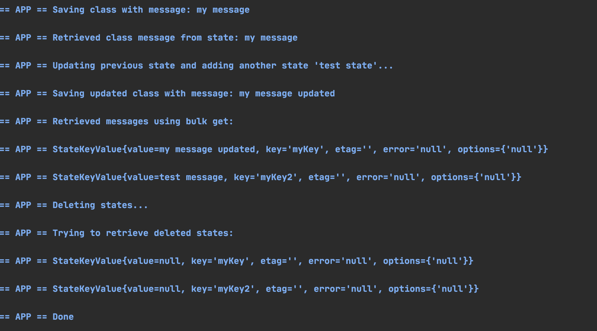

## State management sample

This sample illustrates the capabilities provided by Dapr Java SDK for state management. For further information about state management please refer to [this link](https://github.com/dapr/docs/blob/master/concepts/state-management/state-management.md)

## Pre-requisites

* [Dapr and Dapr Cli](https://github.com/dapr/docs/blob/master/getting-started/environment-setup.md#environment-setup).
* Java JDK 11 (or greater): [Oracle JDK](https://www.oracle.com/technetwork/java/javase/downloads/index.html#JDK11) or [OpenJDK](https://jdk.java.net/13/).
* [Apache Maven](https://maven.apache.org/install.html) version 3.x.

### Checking out the code

Clone this repository:

```sh
git clone https://github.com/dapr/java-sdk.git
cd java-sdk
```

Then build the Maven project:

```sh
# make sure you are in the `java-sdk` directory.
mvn install
```

Then get into the examples directory:
```sh
cd examples
```

### Running the StateClient
This example uses the Java SDK Dapr client in order to save, retrieve and delete a state, in this case, an instance of a class. Multiple state stores are supported since Dapr 0.4. See the code snippet bellow: 

```java
public class StateClient {
  ///...
  private static final String STATE_STORE_NAME = "statestore";

  private static final String FIRST_KEY_NAME = "myKey";

  private static final String SECOND_KEY_NAME = "myKey2";
  ///...
  public static void main(String[] args) throws IOException {
      try (DaprClient client = new DaprClientBuilder().build()) {
        String message = args.length == 0 ? " " : args[0];
  
        MyClass myClass = new MyClass();
        myClass.message = message;
        MyClass secondState = new MyClass();
        secondState.message = "test message";
  
        client.saveState(STATE_STORE_NAME, FIRST_KEY_NAME, myClass).block();
        System.out.println("Saving class with message: " + message);
  
        Mono<State<MyClass>> retrievedMessageMono = client.getState(STATE_STORE_NAME, FIRST_KEY_NAME, MyClass.class);
        System.out.println("Retrieved class message from state: " + (retrievedMessageMono.block().getValue()).message);
  
        System.out.println("Updating previous state and adding another state 'test state'... ");
        myClass.message = message + " updated";
        System.out.println("Saving updated class with message: " + myClass.message);
  
        // execute transaction
        List<TransactionalStateOperation<?>> operationList = new ArrayList<>();
        operationList.add(new TransactionalStateOperation<>(TransactionalStateOperation.OperationType.UPSERT,
                new State<>(myClass, FIRST_KEY_NAME, "")));
        operationList.add(new TransactionalStateOperation<>(TransactionalStateOperation.OperationType.UPSERT,
                new State<>(secondState, SECOND_KEY_NAME, "")));
  
        client.executeTransaction(STATE_STORE_NAME, operationList).block();
  
        // get multiple states
        Mono<List<State<MyClass>>> retrievedMessagesMono = client.getStates(STATE_STORE_NAME,
            Arrays.asList(FIRST_KEY_NAME, SECOND_KEY_NAME), MyClass.class);
        System.out.println("Retrieved messages using bulk get:");
        retrievedMessagesMono.block().forEach(System.out::println);
  
        System.out.println("Deleting states...");
  
        // delete state API
        Mono<Void> mono = client.deleteState(STATE_STORE_NAME, FIRST_KEY_NAME);
        mono.block();
  
        // Delete operation using transaction API
        operationList.clear();
        operationList.add(new TransactionalStateOperation<>(TransactionalStateOperation.OperationType.DELETE,
            new State<>(SECOND_KEY_NAME)));
        mono = client.executeTransaction(STATE_STORE_NAME, operationList);
        mono.block();
  
        Mono<List<State<MyClass>>> retrievedDeletedMessageMono = client.getStates(STATE_STORE_NAME,
            Arrays.asList(FIRST_KEY_NAME, SECOND_KEY_NAME), MyClass.class);
        System.out.println("Trying to retrieve deleted states: ");
        retrievedDeletedMessageMono.block().forEach(System.out::println);
  
        // This is an example, so for simplicity we are just exiting here.
        // Normally a dapr app would be a web service and not exit main.
        System.out.println("Done");
      }
    }
}
```
The code uses the `DaprClient` created by the `DaprClientBuilder`. Notice that this builder uses default settings. Internally, it is using `DefaultObjectSerializer` for two properties: `objectSerializer` is for Dapr's sent and received objects, and `stateSerializer` is for objects to be persisted. 

This example performs multiple operations: 
* `client.saveState(...)` for persisting an instance of `MyClass`.
* `client.getState(...)` operation in order to retrieve back the persisted state using the same key. 
* `client.executeTransaction(...)` operation in order to update existing state and add new state. 
* `client.getStates(...)` operation in order to retrieve back the persisted states using the same keys.
* `client.deleteState(...)` operation to remove  one of the persisted states. 
* `client.executeTransaction(...)` operation in order to remove the other persisted state.

Finally, the code tries to retrieve the deleted states, which should not be found. 

The Dapr client is also within a try-with-resource block to properly close the client at the end.

### Running the example

Run this example with the following command:
```sh
dapr run --components-path ./components --dapr-http-port 3006 -- java -jar target/dapr-java-sdk-examples-exec.jar io.dapr.examples.state.StateClient 'my message'
```
Once running, the OutputBindingExample should print the output as follows:


