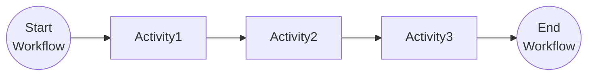
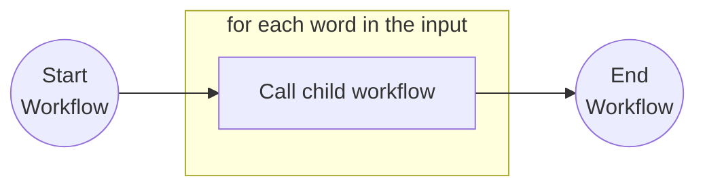
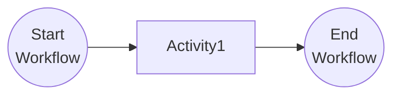
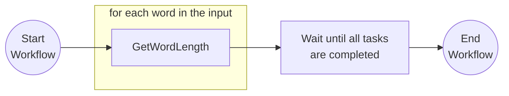

# Dapr Spring Boot Workflow Examples

This application allows you to run different [workflow patterns](https://docs.dapr.io/developing-applications/building-blocks/workflow/workflow-patterns) including: 
- Chained Activities
- Parent/Child Workflows
- Continue workflow by sending External Events
- Fan Out/In activities for parallel execution
- Suspend/Resume workflows

## Running these examples from source code

To run these examples you will need:
- Java SDK
- Maven
- Docker or a container runtime such as Podman

From the `spring-boot-examples/workflows` directory you can start the service by running the following command:

<!-- STEP
name: Run Demo Workflow Application
match_order: none
output_match_mode: substring
expected_stdout_lines:
- 'Started WorkflowPatternsApplication'
background: true
expected_return_code: 143
timeout_seconds: 180
-->
<!-- Timeout for above service must be more than sleep + timeout for the client-->

```sh
../../../mvnw spring-boot:test-run
```

<!-- END_STEP -->

By running the `spring-boot:test-run` goal, the application is loaded using the [test configurations](src/test/java/io/dapr/springboot4/examples/wfp/DaprTestContainersConfig.java) 
configured using [Testcontainers](https://testcontainers.com) to boostrap the [Dapr](https://dapr.io) sidecar and control plane.

Once the application is running you can trigger the different patterns by sending the following requests: 

### Chaining Activities Workflow example

The `io.dapr.springboot.examples.wfp.chain.ChainWorkflow` executes three chained activities. For this example the 
`ToUpperCaseActivity.java` is used to transform to upper case three strings from an array.



<!-- STEP
name: Start Chain Activities Workflow
match_order: none
output_match_mode: substring
expected_stdout_lines:
- 'TOKYO, LONDON, SEATTLE'
timeout_seconds: 90
-->
<!-- Timeout for above service must be more than sleep + timeout for the client-->

To start the workflow with the three chained activities you can run: 

```sh
curl -X POST localhost:8080/wfp/chain -H 'Content-Type: application/json' --retry 10 --max-time 20 --retry-all-errors --retry-max-time 90
```

<!-- END_STEP -->


As result from executing the request you should see: 

```bash
TOKYO, LONDON, SEATTLE
```

In the application output you should see the workflow activities being executed. 

```bash
io.dapr.workflows.WorkflowContext        : Starting Workflow: io.dapr.springboot.examples.wfp.chain.ChainWorkflow
i.d.s.e.w.WorkflowPatternsRestController : Workflow instance 7625b4af-8c04-408a-93dc-bad753466e43 started
i.d.s.e.wfp.chain.ToUpperCaseActivity    : Starting Activity: io.dapr.springboot.examples.wfp.chain.ToUpperCaseActivity
i.d.s.e.wfp.chain.ToUpperCaseActivity    : Message Received from input: Tokyo
i.d.s.e.wfp.chain.ToUpperCaseActivity    : Sending message to output: TOKYO
i.d.s.e.wfp.chain.ToUpperCaseActivity    : Starting Activity: io.dapr.springboot.examples.wfp.chain.ToUpperCaseActivity
i.d.s.e.wfp.chain.ToUpperCaseActivity    : Message Received from input: London
i.d.s.e.wfp.chain.ToUpperCaseActivity    : Sending message to output: LONDON
i.d.s.e.wfp.chain.ToUpperCaseActivity    : Starting Activity: io.dapr.springboot.examples.wfp.chain.ToUpperCaseActivity
i.d.s.e.wfp.chain.ToUpperCaseActivity    : Message Received from input: Seattle
i.d.s.e.wfp.chain.ToUpperCaseActivity    : Sending message to output: SEATTLE
io.dapr.workflows.WorkflowContext        : Workflow finished with result: TOKYO, LONDON, SEATTLE
```

### Parent / Child Workflows example

In this example we start a Parent workflow that calls a child workflow that execute one activity that reverses an input string. 

The Parent workflow looks like this: 



The Child workflow looks like this:



To start the parent workflow you can run:

<!-- STEP
name: Start Parent/Child Workflow
match_order: none
output_match_mode: substring
expected_stdout_lines:
- '!wolfkroW rpaD olleH'
timeout_seconds: 90
-->
<!-- Timeout for above service must be more than sleep + timeout for the client-->

To start the workflow with the three chained activities you can run:

```sh
curl -X POST localhost:8080/wfp/child -H 'Content-Type: application/json' --retry 10 --max-time 20 --retry-all-errors --retry-max-time 90 
```

<!-- END_STEP -->


As result from executing the request you should see:

```bash
!wolfkroW rpaD olleH
```

In the application output you should see the workflow activities being executed.

```bash
io.dapr.workflows.WorkflowContext        : Starting Workflow: io.dapr.springboot.examples.wfp.child.ParentWorkflow
io.dapr.workflows.WorkflowContext        : calling childworkflow with input: Hello Dapr Workflow!
i.d.s.e.w.WorkflowPatternsRestController : Workflow instance f3ec9566-a0fc-4d28-8912-3f3ded3cd8a9 started
io.dapr.workflows.WorkflowContext        : Starting ChildWorkflow: io.dapr.springboot.examples.wfp.child.ChildWorkflow
io.dapr.workflows.WorkflowContext        : ChildWorkflow received input: Hello Dapr Workflow!
io.dapr.workflows.WorkflowContext        : ChildWorkflow is calling Activity: io.dapr.springboot.examples.wfp.child.ReverseActivity
i.d.s.e.wfp.child.ReverseActivity        : Starting Activity: io.dapr.springboot.examples.wfp.child.ReverseActivity
i.d.s.e.wfp.child.ReverseActivity        : Message Received from input: Hello Dapr Workflow!
i.d.s.e.wfp.child.ReverseActivity        : Sending message to output: !wolfkroW rpaD olleH
io.dapr.workflows.WorkflowContext        : ChildWorkflow finished with: !wolfkroW rpaD olleH
io.dapr.workflows.WorkflowContext        : childworkflow finished with: !wolfkroW rpaD olleH
```

### ContinueAsNew Workflows example

In this example we start a workflow that every 3 seconds schedule a new workflow consistently. This workflow executes 
one activity called CleanUpActivity that takes 2 seconds to complete. This loops repeat consistently for 5 times.

To start the workflow you can run:

<!-- STEP
name: Start ContinueAsNew Workflow
match_order: none
output_match_mode: substring
expected_stdout_lines:
- '{"cleanUpTimes":5}'
timeout_seconds: 90
-->
<!-- Timeout for above service must be more than sleep + timeout for the client-->

```sh
curl -X POST localhost:8080/wfp/continueasnew -H 'Content-Type: application/json' --retry 10 --max-time 60 --retry-all-errors --retry-max-time 90
```

<!-- END_STEP -->

As result from executing the request you should see:

```bash
{"cleanUpTimes":5}
```

In the application output you should see the workflow activities being executed.

```bash
io.dapr.workflows.WorkflowContext        : Starting Workflow: io.dapr.springboot.examples.wfp.continueasnew.ContinueAsNewWorkflow
io.dapr.workflows.WorkflowContext        : call CleanUpActivity to do the clean up
i.d.s.e.w.WorkflowPatternsRestController : Workflow instance b808e7d6-ab47-4eba-8188-dc9ff8780764 started
i.d.s.e.w.continueasnew.CleanUpActivity  : Starting Activity: io.dapr.springboot.examples.wfp.continueasnew.CleanUpActivity
i.d.s.e.w.continueasnew.CleanUpActivity  : start clean up work, it may take few seconds to finish... Time:10:48:45
io.dapr.workflows.WorkflowContext        : CleanUpActivity finished
io.dapr.workflows.WorkflowContext        : wait 5 seconds for next clean up
io.dapr.workflows.WorkflowContext        : Let's do more cleaning.
io.dapr.workflows.WorkflowContext        : Starting Workflow: io.dapr.springboot.examples.wfp.continueasnew.ContinueAsNewWorkflow
io.dapr.workflows.WorkflowContext        : call CleanUpActivity to do the clean up
i.d.s.e.w.continueasnew.CleanUpActivity  : Starting Activity: io.dapr.springboot.examples.wfp.continueasnew.CleanUpActivity
i.d.s.e.w.continueasnew.CleanUpActivity  : start clean up work, it may take few seconds to finish... Time:10:48:50
io.dapr.workflows.WorkflowContext        : CleanUpActivity finished
io.dapr.workflows.WorkflowContext        : wait 5 seconds for next clean up
io.dapr.workflows.WorkflowContext        : Let's do more cleaning.
io.dapr.workflows.WorkflowContext        : Starting Workflow: io.dapr.springboot.examples.wfp.continueasnew.ContinueAsNewWorkflow
io.dapr.workflows.WorkflowContext        : call CleanUpActivity to do the clean up
i.d.s.e.w.continueasnew.CleanUpActivity  : Starting Activity: io.dapr.springboot.examples.wfp.continueasnew.CleanUpActivity
i.d.s.e.w.continueasnew.CleanUpActivity  : start clean up work, it may take few seconds to finish... Time:10:48:55
io.dapr.workflows.WorkflowContext        : CleanUpActivity finished
io.dapr.workflows.WorkflowContext        : wait 5 seconds for next clean up
io.dapr.workflows.WorkflowContext        : Let's do more cleaning.
io.dapr.workflows.WorkflowContext        : Starting Workflow: io.dapr.springboot.examples.wfp.continueasnew.ContinueAsNewWorkflow
io.dapr.workflows.WorkflowContext        : call CleanUpActivity to do the clean up
i.d.s.e.w.continueasnew.CleanUpActivity  : Starting Activity: io.dapr.springboot.examples.wfp.continueasnew.CleanUpActivity
i.d.s.e.w.continueasnew.CleanUpActivity  : start clean up work, it may take few seconds to finish... Time:10:49:0
io.dapr.workflows.WorkflowContext        : CleanUpActivity finished
io.dapr.workflows.WorkflowContext        : wait 5 seconds for next clean up
io.dapr.workflows.WorkflowContext        : Let's do more cleaning.
io.dapr.workflows.WorkflowContext        : Starting Workflow: io.dapr.springboot.examples.wfp.continueasnew.ContinueAsNewWorkflow
io.dapr.workflows.WorkflowContext        : call CleanUpActivity to do the clean up
i.d.s.e.w.continueasnew.CleanUpActivity  : Starting Activity: io.dapr.springboot.examples.wfp.continueasnew.CleanUpActivity
i.d.s.e.w.continueasnew.CleanUpActivity  : start clean up work, it may take few seconds to finish... Time:10:49:5
io.dapr.workflows.WorkflowContext        : CleanUpActivity finished
io.dapr.workflows.WorkflowContext        : wait 5 seconds for next clean up
io.dapr.workflows.WorkflowContext        : We did enough cleaning
```

### External Event Workflow example

In this example we start a workflow that as part of its execution waits for an external event to continue. To correlate
workflows and events we use the parameter `orderId`

To start the workflow you can run:

<!-- STEP
name: Start External Event Workflow
match_order: none
output_match_mode: substring
timeout_seconds: 90
-->
<!-- Timeout for above service must be more than sleep + timeout for the client-->

```sh
curl -X POST "localhost:8080/wfp/externalevent?orderId=123" -H 'Content-Type: application/json' --retry 10 --max-time 20 --retry-all-errors --retry-max-time 90
```

<!-- END_STEP -->


In the application output you should see the workflow activities being executed.

```bash
io.dapr.workflows.WorkflowContext        : Starting Workflow: io.dapr.springboot.examples.wfp.externalevent.ExternalEventWorkflow
io.dapr.workflows.WorkflowContext        : Waiting for approval...
i.d.s.e.w.WorkflowPatternsRestController : Workflow instance 8a55cf6d-9059-49b1-8c83-fbe17567a02e started
```

You should see the Workflow ID that was created, in this example you don't need to remember this id, 
as you can use the orderId to find the right instance. 
When you are ready to approve the order you can send the following request:

<!-- STEP
name: Send External Event
match_order: none
output_match_mode: substring
expected_stdout_lines:
- '{"approved":true}'
timeout_seconds: 90
-->
<!-- Timeout for above service must be more than sleep + timeout for the client-->

To send the event you can run:

```sh
curl -X POST "localhost:8080/wfp/externalevent-continue?orderId=123&decision=true" -H 'Content-Type: application/json' --retry 10 --max-time 20 --retry-all-errors --retry-max-time 90
```

<!-- END_STEP -->

```bash
{"approved":true}
```

In the application output you should see the workflow activities being executed.

```bash
i.d.s.e.w.WorkflowPatternsRestController : Workflow instance e86bc464-6166-434d-8c91-d99040d6f54e continue
io.dapr.workflows.WorkflowContext        : approval granted - do the approved action
i.d.s.e.w.externalevent.ApproveActivity  : Starting Activity: io.dapr.springboot.examples.wfp.externalevent.ApproveActivity
i.d.s.e.w.externalevent.ApproveActivity  : Running approval activity...
io.dapr.workflows.WorkflowContext        : approval-activity finished
```

### Fan Out/In Workflow example

In this example we start a workflow that takes an ArrayList of strings and calls one activity per item in the ArrayList. The activities
are executed and the workflow waits for all of them to complete to aggregate the results.



To start the workflow you can run:

<!-- STEP
name: Start Parent/Child Workflow
match_order: none
output_match_mode: substring
expected_stdout_lines:
- '{"wordCount":60}'
timeout_seconds: 90
-->
<!-- Timeout for above service must be more than sleep + timeout for the client-->

```sh
curl -X POST localhost:8080/wfp/fanoutin -H 'Content-Type: application/json' -d @body.json --retry 10 --max-time 20 --retry-all-errors --retry-max-time 90
```

<!-- END_STEP -->

As result from executing the request you should see:

```bash
{"wordCount":60}
```

In the application output you should see the workflow activities being executed.

```bash
io.dapr.workflows.WorkflowContext        : Starting Workflow: io.dapr.springboot.examples.wfp.fanoutin.FanOutInWorkflow
i.d.s.e.w.WorkflowPatternsRestController : Workflow instance a771a7ba-f9fb-4399-aaee-a2fb0b102e5d started
i.d.s.e.wfp.fanoutin.CountWordsActivity  : Starting Activity: io.dapr.springboot.examples.wfp.fanoutin.CountWordsActivity
i.d.s.e.wfp.fanoutin.CountWordsActivity  : Starting Activity: io.dapr.springboot.examples.wfp.fanoutin.CountWordsActivity
i.d.s.e.wfp.fanoutin.CountWordsActivity  : Starting Activity: io.dapr.springboot.examples.wfp.fanoutin.CountWordsActivity
i.d.s.e.wfp.fanoutin.CountWordsActivity  : Activity returned: 2.
i.d.s.e.wfp.fanoutin.CountWordsActivity  : Activity finished
i.d.s.e.wfp.fanoutin.CountWordsActivity  : Activity returned: 11.
i.d.s.e.wfp.fanoutin.CountWordsActivity  : Activity returned: 17.
i.d.s.e.wfp.fanoutin.CountWordsActivity  : Activity finished
i.d.s.e.wfp.fanoutin.CountWordsActivity  : Activity finished
i.d.s.e.wfp.fanoutin.CountWordsActivity  : Starting Activity: io.dapr.springboot.examples.wfp.fanoutin.CountWordsActivity
i.d.s.e.wfp.fanoutin.CountWordsActivity  : Activity returned: 21.
i.d.s.e.wfp.fanoutin.CountWordsActivity  : Activity finished
i.d.s.e.wfp.fanoutin.CountWordsActivity  : Starting Activity: io.dapr.springboot.examples.wfp.fanoutin.CountWordsActivity
i.d.s.e.wfp.fanoutin.CountWordsActivity  : Activity returned: 9.
i.d.s.e.wfp.fanoutin.CountWordsActivity  : Activity finished
io.dapr.workflows.WorkflowContext        : Workflow finished with result: 60
```

### Suspend/Resume Workflow example

In this example, we start a workflow that executes an activity and then waits for an event. While the workflow instance 
is waiting for the event, we execute a suspend workflow operation. Once we check the state of the instance, a resume
operation is executed. 

To start the workflow, you can run:

<!-- STEP
name: Start Suspend/Resume Workflow
match_order: none
output_match_mode: substring
timeout_seconds: 90
-->
<!-- Timeout for above service must be more than sleep + timeout for the client-->

```sh
curl -X POST "localhost:8080/wfp/suspendresume?orderId=456" -H 'Content-Type: application/json' --retry 10 --max-time 20 --retry-all-errors --retry-max-time 90
```

<!-- END_STEP -->

In the application output you should see the workflow activities being executed.

```bash
io.dapr.workflows.WorkflowContext        : Starting Workflow: io.dapr.springboot.examples.wfp.suspendresume.SuspendResumeWorkflow
i.d.s.e.w.WorkflowPatternsRestController : Workflow instance 2de2b968-900a-4f5b-9092-b26aefbfc6b3 started
i.d.s.e.w.s.PerformTaskActivity          : Starting Activity: io.dapr.springboot.examples.wfp.suspendresume.PerformTaskActivity
i.d.s.e.w.s.PerformTaskActivity          : Running activity...
i.d.s.e.w.s.PerformTaskActivity          : Completing activity...
io.dapr.workflows.WorkflowContext        : Waiting for approval...

```

You should see the Workflow ID that was created, in this example you don't need to remember this id,
as you can use the orderId to find the right instance.


<!-- STEP
name: Suspend Workflow Operation
match_order: none
output_match_mode: substring
expected_stdout_lines:
- 'SUSPENDED'
timeout_seconds: 90
-->


Let's suspend the workflow instance by sending the following request:

```sh
curl -X POST "localhost:8080/wfp/suspendresume/suspend?orderId=456" -H 'Content-Type: application/json' --retry 10 --max-time 20 --retry-all-errors --retry-max-time 90
```

<!-- END_STEP -->


You should see the output of the requests:

```sh
SUSPENDED
```

Now, let's resume the workflow instance: 

<!-- STEP
name: Resume Workflow Operation
match_order: none
output_match_mode: substring
expected_stdout_lines:
- 'RUNNING'
timeout_seconds: 90
-->


To send the event you can run:

```sh
curl -X POST "localhost:8080/wfp/suspendresume/resume?orderId=456" -H 'Content-Type: application/json' --retry 10 --max-time 20 --retry-all-errors --retry-max-time 90
```

<!-- END_STEP -->

You should see the output of the requests:

```sh
RUNNING
```

Now, let's send the event that the instance is waiting to validate that the workflow complete after 
being suspended and resumed. 

<!-- STEP
name: Send External Event
match_order: none
output_match_mode: substring
expected_stdout_lines:
- '{"approved":true}'
timeout_seconds: 90
-->
<!-- Timeout for above service must be more than sleep + timeout for the client-->

To send the event you can run:

```sh
curl -X POST "localhost:8080/wfp/suspendresume/continue?orderId=456&decision=true" -H 'Content-Type: application/json' --retry 10 --max-time 20 --retry-all-errors --retry-max-time 90
```

<!-- END_STEP -->

The output of the request contains the output of the workflow based on the `decision` parameter that we sent.

```bash
{"approved":true}
```

In the application output you should see, that the workflow instance completed correctly: 

```sh
i.d.s.e.w.WorkflowPatternsRestController : Workflow instance 2de2b968-900a-4f5b-9092-b26aefbfc6b3 continue
io.dapr.workflows.WorkflowContext        : approval-event arrived
i.d.s.e.w.s.PerformTaskActivity          : Starting Activity: io.dapr.springboot.examples.wfp.suspendresume.PerformTaskActivity
i.d.s.e.w.s.PerformTaskActivity          : Running activity...
i.d.s.e.w.s.PerformTaskActivity          : Completing activity...
```

## Testing workflow executions

Workflow execution can be tested using Testcontainers and you can find all the tests for the patterns covered in this 
application [here](src/test/java/io/dapr/springboot4/examples/wfp/TestWorkflowPatternsApplication.java).
