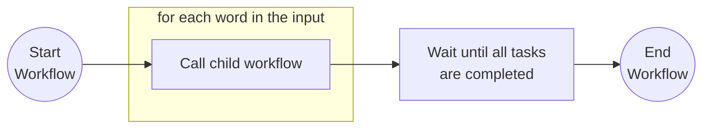

# Dapr Spring Boot Workflow Examples

This application allows you to run different workflow patterns including: 
- Chained Activities
- Parent/Child Workflows
- Continue workflow by sending External Events
- Fan Out/In activities for parallel execution

## Running these examples from source code

To run these examples you will need:
- Java SDK
- Maven
- Docker or a container runtime such as Podman

From the `spring-boot-examples/workflows` directory you can start the service using the test configuration that uses
[Testcontainers](https://testcontainers.com) to boostrap [Dapr](https://dapr.io) by running the following command:

<!-- STEP
name: Run Demo Workflow Application
match_order: none
output_match_mode: substring
expected_stdout_lines:
- 'Started WorkflowPatternsApplication'
background: true
expected_return_code: 143
sleep: 30
timeout_seconds: 45
-->
<!-- Timeout for above service must be more than sleep + timeout for the client-->

```sh
cd workflows/
../../mvnw spring-boot:test-run
```

<!-- END_STEP -->

Once the application is running you can trigger the different patterns by sending the following requests: 

### Chaining Activities Workflow example

The `io.dapr.springboot.examples.wfp.chain.ChainWorkflow` executes three chained activities. For this example the 
`ToUpperCaseActivity.java` is used to transform to upper case three strings from an array.


<!-- STEP
name: Start Customer Workflow
match_order: none
output_match_mode: substring
expected_stdout_lines:
- 'New Workflow Instance created for Customer'
background: true
sleep: 1
timeout_seconds: 2
-->
<!-- Timeout for above service must be more than sleep + timeout for the client-->

```sh
curl -X POST localhost:8080/wfp/chain -H 'Content-Type: application/json' 
```

<!-- END_STEP -->


As result from executing the request you should see: 

```bash
TOKYO, LONDON, SEATTLE
```

In the application output you should see the workflow activities being executed. 

```bash
2025-05-16T09:59:22.176+01:00  INFO 8360 --- [pool-3-thread-1] io.dapr.workflows.WorkflowContext        : Starting Workflow: io.dapr.springboot.examples.wfp.chain.ChainWorkflow
2025-05-16T09:59:22.194+01:00  INFO 8360 --- [nio-8080-exec-2] i.d.s.e.w.WorkflowPatternsRestController : Workflow instance 7625b4af-8c04-408a-93dc-bad753466e43 started
2025-05-16T09:59:22.195+01:00  INFO 8360 --- [pool-3-thread-2] i.d.s.e.wfp.chain.ToUpperCaseActivity    : Starting Activity: io.dapr.springboot.examples.wfp.chain.ToUpperCaseActivity
2025-05-16T09:59:22.196+01:00  INFO 8360 --- [pool-3-thread-2] i.d.s.e.wfp.chain.ToUpperCaseActivity    : Message Received from input: Tokyo
2025-05-16T09:59:22.197+01:00  INFO 8360 --- [pool-3-thread-2] i.d.s.e.wfp.chain.ToUpperCaseActivity    : Sending message to output: TOKYO
2025-05-16T09:59:22.210+01:00  INFO 8360 --- [pool-3-thread-1] i.d.s.e.wfp.chain.ToUpperCaseActivity    : Starting Activity: io.dapr.springboot.examples.wfp.chain.ToUpperCaseActivity
2025-05-16T09:59:22.210+01:00  INFO 8360 --- [pool-3-thread-1] i.d.s.e.wfp.chain.ToUpperCaseActivity    : Message Received from input: London
2025-05-16T09:59:22.210+01:00  INFO 8360 --- [pool-3-thread-1] i.d.s.e.wfp.chain.ToUpperCaseActivity    : Sending message to output: LONDON
2025-05-16T09:59:22.216+01:00  INFO 8360 --- [pool-3-thread-3] i.d.s.e.wfp.chain.ToUpperCaseActivity    : Starting Activity: io.dapr.springboot.examples.wfp.chain.ToUpperCaseActivity
2025-05-16T09:59:22.216+01:00  INFO 8360 --- [pool-3-thread-3] i.d.s.e.wfp.chain.ToUpperCaseActivity    : Message Received from input: Seattle
2025-05-16T09:59:22.216+01:00  INFO 8360 --- [pool-3-thread-3] i.d.s.e.wfp.chain.ToUpperCaseActivity    : Sending message to output: SEATTLE
2025-05-16T09:59:22.219+01:00  INFO 8360 --- [pool-3-thread-1] io.dapr.workflows.WorkflowContext        : Workflow finished with result: TOKYO, LONDON, SEATTLE
```

### Parent / Child Workflows example





## Testing workflow executions

Workflow execution can be tested using Testcontainers and you can find all the tests for the patterns covered in this 
application [here](test/java/io/dapr/springboot/examples/wfp/TestWorkflowPatternsApplication.java).